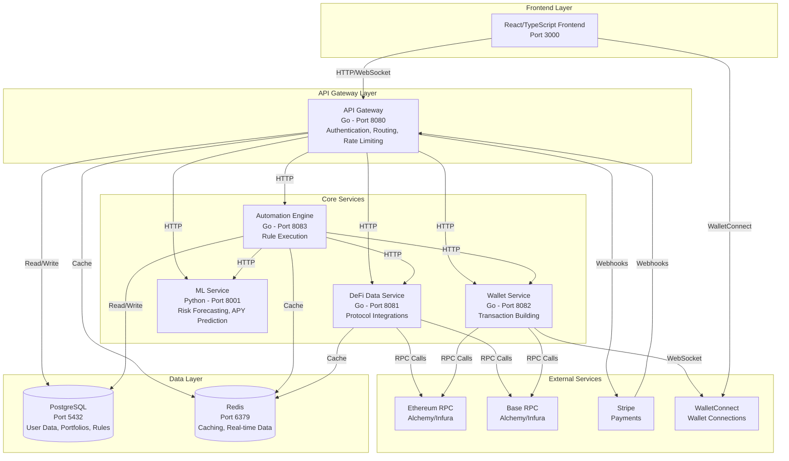
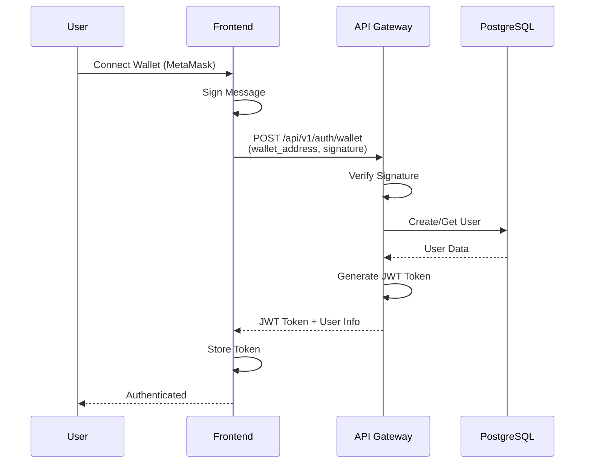
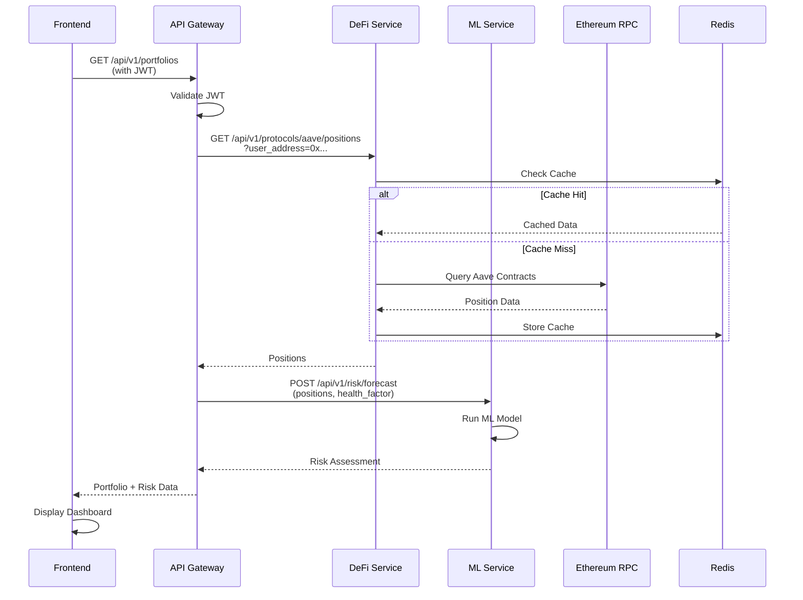
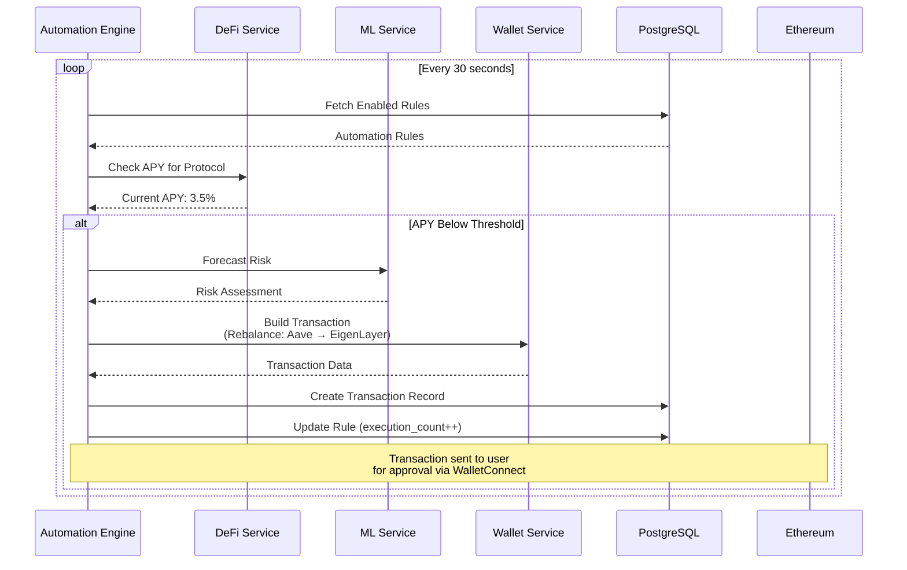
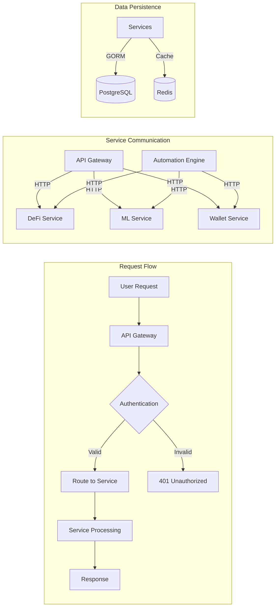
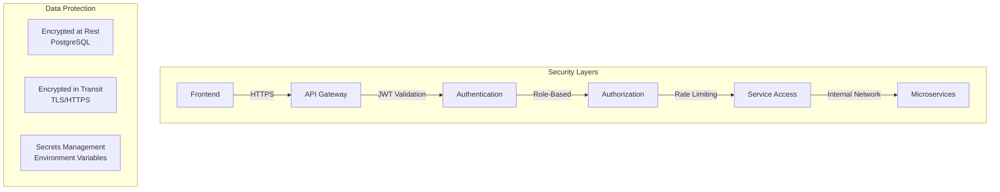
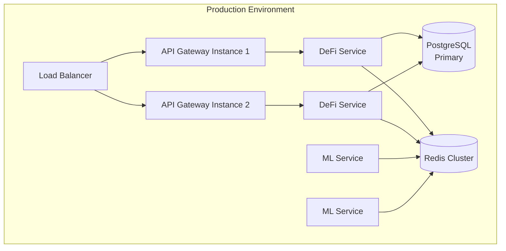

# Architecture Documentation

## System Architecture Overview

The DeFi AI Optimization Platform is built as a microservices architecture with clear separation of concerns.

## Data Flow Diagrams

### User Authentication Flow

### Portfolio Monitoring Flow

### Automation Execution Flow

## Component Interaction Diagram

## Technology Stack by Layer

### Frontend
- **Framework**: React 18 with TypeScript
- **Build Tool**: Vite
- **State Management**: Zustand + React Query
- **Blockchain**: ethers.js
- **Charts**: Recharts
- **Routing**: React Router

### Backend Services (Go)
- **HTTP Framework**: Gin
- **Database ORM**: GORM
- **Authentication**: JWT
- **WebSocket**: Gorilla WebSocket
- **Blockchain**: go-ethereum
- **Payments**: Stripe Go SDK

### ML Service (Python)
- **Framework**: FastAPI
- **ML Libraries**: scikit-learn
- **Data Processing**: pandas, numpy
- **Blockchain**: web3.py

### Infrastructure
- **Containerization**: Docker & Docker Compose
- **Database**: PostgreSQL 15
- **Cache**: Redis 7
- **Message Queue**: (Future: RabbitMQ/NATS)

## Service Responsibilities

### API Gateway
- **Purpose**: Single entry point for all client requests
- **Responsibilities**:
  - Request routing to appropriate services
  - JWT authentication and authorization
  - Rate limiting
  - CORS handling
  - WebSocket hub for real-time updates
  - Stripe webhook handling

### DeFi Data Service
- **Purpose**: Aggregate data from DeFi protocols
- **Responsibilities**:
  - Monitor APYs across protocols (Aave, Compound, EigenLayer)
  - Track user positions and health factors
  - Fetch asset prices
  - Cache frequently accessed data
  - Support multiple chains (Ethereum, Base)

### ML Service
- **Purpose**: AI-powered risk and trend analysis
- **Responsibilities**:
  - Liquidation risk prediction
  - APY trend forecasting
  - Portfolio optimization recommendations
  - Model inference and serving

### Wallet Service
- **Purpose**: Handle wallet interactions and transactions
- **Responsibilities**:
  - WalletConnect/MetaMask integration
  - Transaction building and signing
  - Multi-chain transaction support
  - Gas estimation and optimization

### Automation Engine
- **Purpose**: Execute automated DeFi strategies
- **Responsibilities**:
  - Monitor automation rules
  - Evaluate trigger conditions
  - Execute rebalancing actions
  - Coordinate with other services
  - Track execution history

## Security Architecture

## Scalability Considerations

- **Horizontal Scaling**: Each service can be scaled independently
- **Caching Strategy**: Redis for frequently accessed data
- **Database**: PostgreSQL with connection pooling
- **Load Balancing**: (Future: Add nginx/HAProxy in front of API Gateway)
- **Message Queue**: (Future: For async job processing)

## Deployment Architecture

