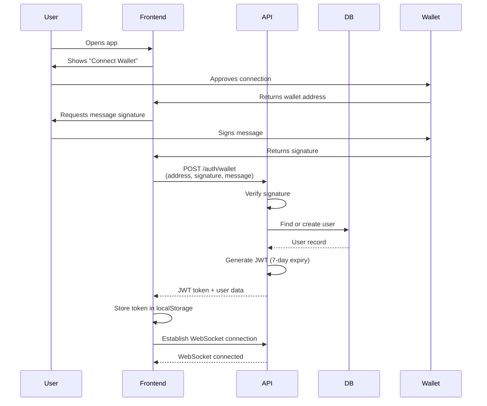
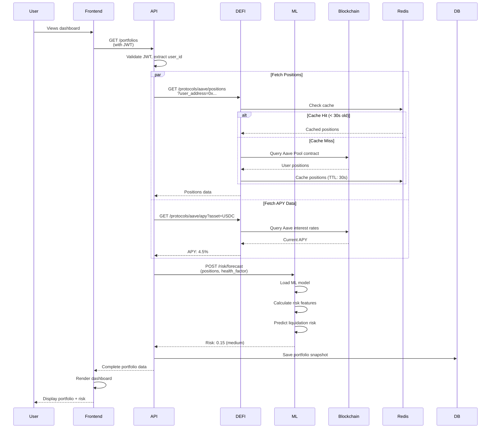
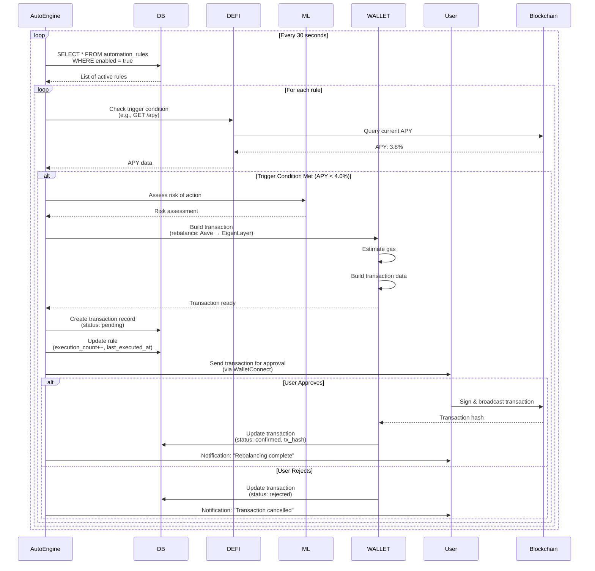
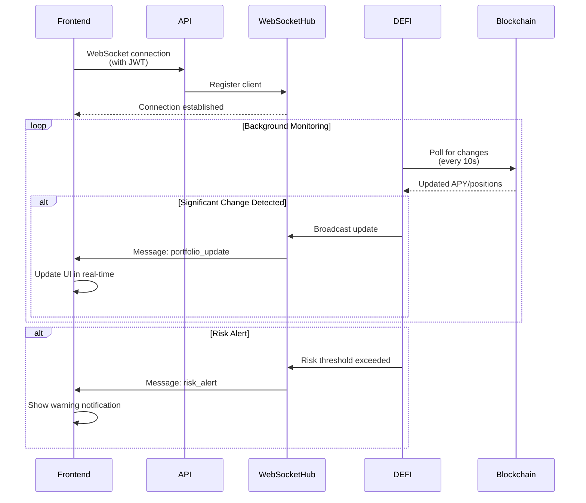
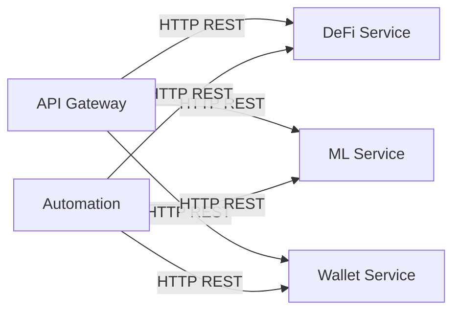
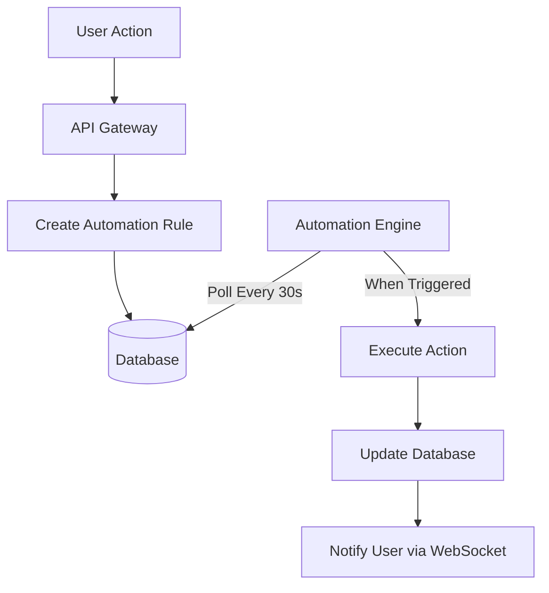
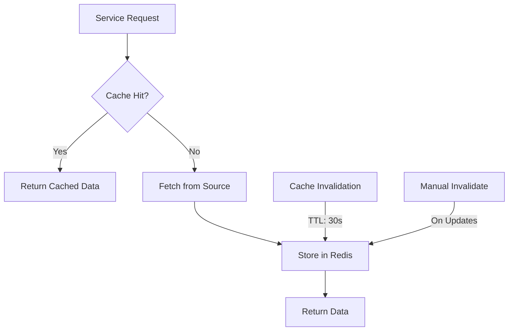
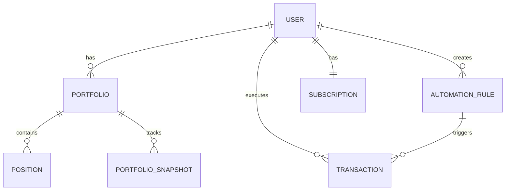
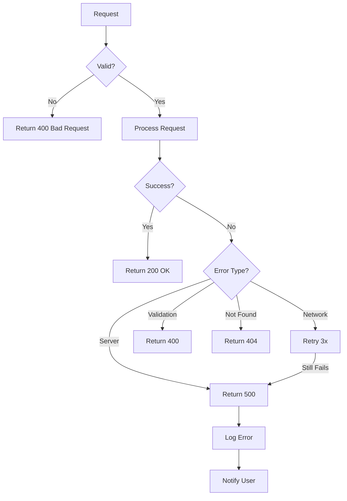

# Data Flow Documentation

## End-to-End User Journey

### 1. User Registration & Authentication

### 2. Portfolio Discovery & Risk Assessment

### 3. Automation Rule Execution

### 4. Real-time Updates via WebSocket

## Service Communication Patterns

### Synchronous HTTP Calls

### Asynchronous Processing

## Data Storage Patterns

### Caching Strategy

### Database Schema Relationships

## Error Handling Flow

