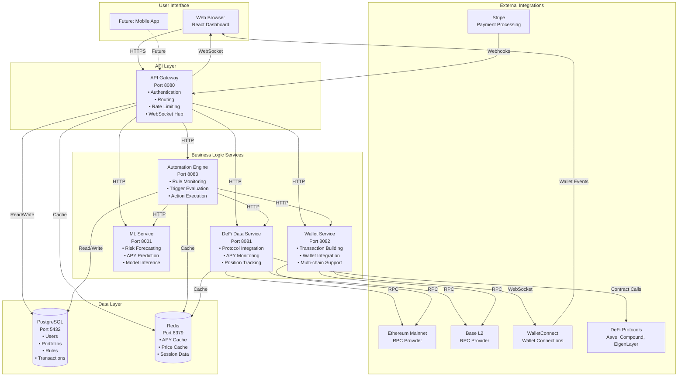
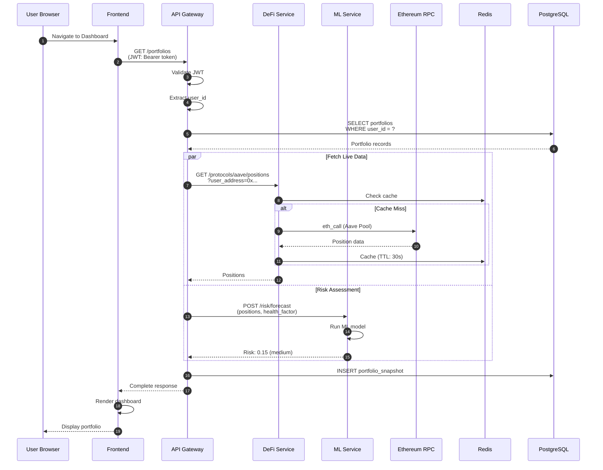

# System Overview

## High-Level Architecture



## Request Flow Example: User Views Portfolio



## Component Interaction Matrix

| Component | Communicates With | Protocol | Purpose |
|-----------|------------------|----------|---------|
| Frontend | API Gateway | HTTP/WebSocket | User requests, real-time updates |
| API Gateway | All Services | HTTP | Request routing |
| API Gateway | PostgreSQL | SQL (via GORM) | Data persistence |
| API Gateway | Redis | Redis Protocol | Session caching |
| DeFi Service | Blockchain RPCs | JSON-RPC | Fetch protocol data |
| DeFi Service | Redis | Redis Protocol | Cache APY/price data |
| ML Service | Redis | Redis Protocol | Cache model inputs |
| Automation Engine | DeFi Service | HTTP | Check trigger conditions |
| Automation Engine | ML Service | HTTP | Get risk assessments |
| Automation Engine | Wallet Service | HTTP | Build transactions |
| Automation Engine | PostgreSQL | SQL (via GORM) | Store execution history |
| Wallet Service | Blockchain RPCs | JSON-RPC | Build/send transactions |
| Wallet Service | WalletConnect | WebSocket | Wallet connections |

## Data Flow Patterns

### Read Pattern (Cached)
```
User Request → API Gateway → Check Redis → Return Cached Data
                                    ↓ (miss)
                              Service → External API → Store in Redis → Return Data
```

### Write Pattern
```
User Action → API Gateway → Validate → Service → Database → WebSocket Broadcast → Frontend Update
```

### Automation Pattern
```
Background Loop → Check Rules → Evaluate Triggers → Execute Actions → Update Database → Notify User
```

## Technology Decisions

### Why Go for Backend?
- **Performance**: Fast compilation and execution
- **Concurrency**: Excellent goroutine support for handling multiple requests
- **Blockchain**: Strong ecosystem (go-ethereum)
- **Type Safety**: Compile-time error checking

### Why Python for ML?
- **ML Ecosystem**: Rich libraries (scikit-learn, pandas, numpy)
- **Rapid Development**: Easy model prototyping
- **FastAPI**: Modern async framework
- **Integration**: Easy to call from Go services

### Why React/TypeScript?
- **Type Safety**: Catch errors at compile time
- **Ecosystem**: Rich library ecosystem
- **Performance**: Virtual DOM and optimizations
- **Developer Experience**: Great tooling

### Why Microservices?
- **Scalability**: Scale services independently
- **Technology Flexibility**: Use best tool for each service
- **Fault Isolation**: One service failure doesn't bring down entire system
- **Team Structure**: Different teams can own different services

## Performance Characteristics

### Expected Latencies

| Operation | Typical Latency | Notes |
|-----------|----------------|-------|
| API Gateway (cached) | < 10ms | Redis cache hit |
| API Gateway (uncached) | 50-200ms | External service call |
| DeFi Data Fetch | 100-500ms | Blockchain RPC call |
| ML Inference | 50-150ms | Model prediction |
| Database Query | 5-20ms | Simple queries |
| WebSocket Message | < 5ms | Real-time push |

### Scalability Limits

- **API Gateway**: ~1000 req/s per instance
- **DeFi Service**: Limited by RPC provider rate limits
- **ML Service**: ~100 predictions/s per instance
- **Database**: PostgreSQL can handle 1000s of concurrent connections
- **Redis**: Very high throughput (100k+ ops/s)

## Security Architecture

### Authentication Flow
```
Wallet Connection → Message Signing → Signature Verification → JWT Generation → Token Storage
```

### Authorization
- JWT tokens contain user_id
- Middleware validates tokens on protected routes
- WebSocket connections require valid JWT

### Data Protection
- Database: Encrypted at rest (PostgreSQL)
- Network: HTTPS/TLS for all external communication
- Secrets: Environment variables (never in code)
- API Keys: Stored securely, rotated regularly

## Monitoring & Observability

### Health Checks
- All services expose `/health` endpoints
- Docker health checks configured
- Database connection monitoring

### Logging
- Structured logging in all services
- Docker logs: `docker compose logs [service]`
- Future: Centralized logging (ELK stack)

### Metrics (Future)
- Request rates
- Error rates
- Response times
- Cache hit rates
- Database query performance

